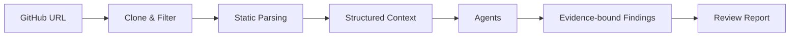

# CodePilot | AI Code Review and Repository Understanding System

中文版: [README.md](README.md)

CodePilot is an AI code review and repository understanding system for Python repositories. It performs engineering noise reduction, structured context building, and evidence binding before generating reviewable code review reports — instead of dumping the repository directly into an LLM.


## Contents

- [Why CodePilot](#why-codepilot)
- [What It Does](#what-it-does)
- [How It Works](#how-it-works)
- [Results](#results)
- [Verification](#verification)
- [Quick Start](#quick-start)
- [Docker Local Run](#docker-local-run)
- [Tech Stack](#tech-stack)
- [Limits & Roadmap](#limits--roadmap)
- [Contributing](#contributing)
- [License](#license)

## Why CodePilot

Reviewing small-to-medium Python repositories often runs into three practical problems:

- Manual repository reading is time-consuming and experience-dependent; output consistency varies with reviewer expertise.
- Asking a general-purpose LLM directly often lacks complete repository context, leading to generic suggestions with weak traceability.
- Traditional static analysis tools focus on syntax and style checks, but usually do not produce architecture-level review reports.

CodePilot targets small-to-medium Python repositories with a "static facts first, LLM explanation second" approach: repository files, symbols, dependencies, and size metrics are extracted into structured context before the model generates evidence-backed code review reports.

## What It Does

Given a public repository URL, CodePilot produces a four-section review report:

- **Architecture overview** — repository structure and module relationships
- **Code smells** — locatable, specific issues
- **Maintainability analysis** — assessment based on structured metrics
- **Refactoring suggestions** — improvement suggestions with evidence citations

### Goals

- Generate structured, reviewable, evidence-cited AI code review reports for small-to-medium Python repositories.
- Perform pre-LLM static parsing and noise reduction to reduce model input size.
- Bind structured evidence so suggestions can be traced to files, functions, classes, dependencies, and metrics.
- Decouple Mock / Real LLM modes for reproducible development, testing, and CI.

### Boundaries

- Not a replacement for security auditing; no automatic fix commitment.
- No commitment to full language coverage; Python is the current priority.
- User repository code is not executed; analysis is static only.
- Not packaged as a full commercial code review platform.

## How It Works



### Upfront Engineering Noise Reduction

CodePilot does not send the entire raw repository directly to the model. It first reduces engineering noise before LLM generation:

- Filters low-value content such as `.git`, `__pycache__`, `.venv`, `dist`, and `build`.
- Keeps source files, configuration files, and README so the model can still understand repository structure.
- Uses Python AST to extract functions, classes, imports, dependencies, and file-scale metrics, with a tree-sitter extension-ready path.
- Replaces raw-code direct prompting with structured context, reducing noise while preserving locatable engineering facts.

### Report Quality Control

Report generation is constrained by a schema, not free-form prose:

- The report always uses four sections: architecture overview, code smells, maintainability analysis, and refactoring suggestions.
- `ReportContract` standardizes the report structure and reduces the impact of LLM output variation on the frontend and stored history.
- Evidence fields bind each finding to file paths, functions, classes, dependencies, and metrics.
- The goal is to make reports reviewable, not to produce a long subjective assessment without traceable evidence.

### Engineering Stability

The system separates real model calls from local engineering verification:

- Mock LLM is used for development, testing, and CI with reproducible output.
- Real LLM is used for actual report generation validation.
- Provider interfaces isolate the model invocation layer, making it possible to switch between different OpenAI-compatible providers.
- Tasks are recorded by phase, so failures can be located to clone, parsing, LLM, or report composition stages.
- `pytest` / `ruff` / `audit_harness` cover tests, static checks, and full-chain validation.

## Results

### Engineering Noise Reduction

| Metric | Result | Method |
|---|---:|---|
| Average file noise reduction | 49.1% | 3 benchmark repos, `git ls-files` business-file baseline |
| Structured-context token compression | 96.8% | Same valid source scope vs structured context, tiktoken estimation |

### Real LLM Single-Repository Validation

- Validation repository: httpx.
- Baseline input tokens: 137,417.
- CodePilot input tokens: 15,212.
- Input size reduction: about 8.85x.
- Real LLM call input token compression: 88.7%.

Note: This is a qualitative single-repository validation on httpx, not a large-scale statistical conclusion. Only input tokens are counted; output tokens are excluded, so this must not be described as total cost reduction.

### Engineering Quality

| Validation Dimension | Result | Method |
|---|---|---|
| pytest | 1034 passed, 1 skipped | Native test output |
| ruff | 0 issues | Static check |
| audit_harness | passed | Full-chain audit validation |
| Mock-mode review success rate | 100% | Mock contract and evidence field completeness |
| Docker local run | verified | config / build / up passed |

## Verification

Benchmark verification completed on the following Python open-source repositories:

- [httpx](https://github.com/encode/httpx)
- [click](https://github.com/pallets/click)
- [uvicorn](https://github.com/encode/uvicorn)

## Quick Start

### Windows PowerShell Script Startup

The repository includes Windows PowerShell scripts that create the `codepilot` conda environment, install dependencies, and start both services:

```powershell
git clone https://github.com/Strange-Men/CodePilot.git
cd CodePilot
Set-ExecutionPolicy -Scope Process Bypass
.\scripts\setup.ps1
.\scripts\start-demo.ps1
```

After startup:

- Frontend: [http://localhost:3000](http://localhost:3000)
- Backend: [http://localhost:8000](http://localhost:8000)
- Health Check: [http://localhost:8000/health](http://localhost:8000/health)

If `conda.exe` is not on PATH:

```powershell
$env:CODEPILOT_CONDA = "path\to\your\conda.exe"
.\scripts\setup.ps1
```

### Manual Startup

```powershell
# Backend
python -m venv .venv
.venv\Scripts\Activate.ps1
pip install -r backend/requirements.txt
python -m uvicorn backend.main:app --reload --host 127.0.0.1 --port 8000

# Frontend (new terminal)
cd frontend
npm install
npm run dev -- --port 3000
```

On Windows PowerShell, you can explicitly set the backend URL before starting the frontend:

```powershell
$env:NEXT_PUBLIC_API_BASE = "http://localhost:8000"
npm run dev -- --port 3000
```

## Docker Local Run

```powershell
# Windows
Copy-Item .env.example .env
docker compose up --build

# macOS / Linux
cp .env.example .env
docker compose up --build
```

Open:

- Frontend: http://localhost:3000
- Backend: http://localhost:8000
- Health: http://localhost:8000/health

Default mode is Mock LLM — no real API key required. To use a real model, configure the provider API key in `.env`. See [Docker local run docs](docs/DOCKER.md) for details.

Stop and clean up:

```powershell
docker compose down        # stop containers
docker compose down -v     # stop and remove SQLite/workspace/reports volumes
```

## Tech Stack

| Layer | Stack | Notes |
|---|---|---|
| Backend | FastAPI + Pydantic + Uvicorn | Structured API, parameter validation, async service |
| Frontend | Next.js + React + TypeScript + Tailwind CSS | Review workspace, task state, evidence display |
| Persistence | SQLite (WAL mode) | Task state and historical report persistence |
| Parsing | Python AST + tree-sitter | Python-first, with a path for multi-language expansion |
| LLM | Mock Provider + OpenAI-compatible Real LLM Provider | Mock by default; Real LLM configurable |
| Deployment | Docker Compose | Local development and demo environment |
| Quality | pytest + ruff + audit_harness + GitHub Actions | Tests, static checks, full-chain audit, and CI |

## Limits & Roadmap

### Current Limitations

- Python repositories are the current priority.
- Real LLM cost and availability depend on provider configuration.
- Chinese reports have quality gates in place, but extreme model outputs still need ongoing regression testing.
- Docker is currently positioned for local demo / development, not production-grade deployment.
- JavaScript / TypeScript parsing entry points and tests exist, but analysis depth is currently weaker than Python.

### Roadmap

- **Short-term**: Continue strengthening Chinese/English report quality gates; add more real-repository benchmarks.
- **Mid-term**: Expand JavaScript/TypeScript repository understanding; enhance evidence chain visualization.
- **Long-term**: Support more complete repository-level agent workflows.

## Contributing

Issues and PRs are welcome. Please include reproduction steps, test commands, and a description of changes.

## License

MIT License
