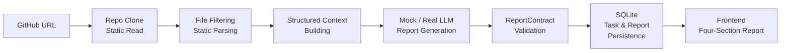

# CodePilot | AI Code Review and Repository Understanding System

中文版: [README.md](README.md)

Static analysis + structured context + evidence binding for reviewable AI-generated repository reports.


## 📚 Table of Contents

- [Project Background](#-project-background-why-build-it)
- [Positioning and Core Capabilities](#-positioning-and-core-capabilities)
- [Architecture and Core Implementation](#️-architecture-and-core-implementation)
- [Tech Stack](#️-tech-stack)
- [Quantified Results](#-quantified-results)
- [Quick Start](#-quick-start)
- [Project Structure](#-project-structure)
- [Roadmap](#️-roadmap)
- [Current Limitations](#️-current-limitations)
- [FAQ](#-faq)
- [Contributing](#-contributing)
- [License](#-license)

## 🎯 Project Background: Why Build It?

Understanding and reviewing small-to-medium GitHub repositories often runs into three practical problems:

- Manual repository reading is time-consuming, experience-dependent, and hard to keep consistent.
- Asking a general LLM directly often misses complete repository context and produces generic suggestions with weak traceability.
- Traditional static analysis tools focus on syntax, style, and security checks, but usually do not produce architecture-level understanding reports.

CodePilot targets small-to-medium Python repositories. It follows a "static facts first, LLM explanation second" approach: source files, symbols, dependencies, and size metrics are extracted into structured context before the model generates an evidence-backed review report.

## ✨ Positioning and Core Capabilities

CodePilot is an AI code review MVP for small-to-medium GitHub repositories, with Python as the current priority. Given a public repository URL, it reads the repository statically and produces a four-section report:

- Architecture overview
- Code smells
- Maintainability analysis
- Refactoring suggestions

### Core Capabilities

- **Pre-LLM static parsing and noise reduction**: Filters low-value files to reduce LLM input size.
- **Structured Evidence Binding**: Each finding is bound to specific file paths, functions, classes, dependencies, and metrics for traceability.
- **ReportContract**: A unified report schema that constrains LLM output to a fixed four-section format, absorbing output variation.
- **Mock / Real LLM dual modes**: Mock LLM for reproducible development, testing, and CI; Real LLM for actual report generation validation.
- **Provider interfaces**: Isolate the model invocation layer, making it easy to swap between Mock and different real LLMs.
- **SQLite persistence**: Saves task state and historical reports for frontend polling and display.

### Current Non-Goals

- Not designed for large monorepos.
- No full coverage across all programming languages.
- Does not execute user repository code; analysis is static only.
- Does not automatically fix code.
- Not a mature commercial code review platform.

## 🏗️ Architecture and Core Implementation

### End-to-End Pipeline



> Text pipeline: GitHub URL → Repo clone → File filtering / static parsing → Structured context building → Mock / Real LLM report generation → ReportContract validation → SQLite persistence → Frontend presentation

### 1. Upfront Engineering Noise Reduction

**Core goal:** Transform messy raw files into low-noise, structured, measurable repository facts for the LLM.

- Filters low-value content such as `.git`, `__pycache__`, `.venv`, `dist`, and `build` to reduce无效 context.
- Keeps source files, configuration files, and README so the model can still understand the project structure.
- Uses Python AST, with a tree-sitter extension-ready parsing path, to extract functions, classes, imports, dependencies, and file-scale metrics.
- Replaces raw-code prompting with structured context so the model receives less noise while keeping locatable engineering facts.

### 2. Report Quality Control

**Core goal:** Ensure consistent report format and reviewable suggestions, not free-form subjective assessments.

- Uses a fixed four-section report structure: architecture overview, code smells, maintainability analysis, and refactoring suggestions.
- `ReportContract` (unified report schema) constrains LLM output to a fixed format and absorbs output variation.
- Evidence Binding ensures each finding is bound to file paths, functions, classes, dependencies, and metrics for human review.
- The goal is a traceable, verifiable report — not one that depends on LLM free-form generation.

### 3. Engineering Stability

**Core goal:** Make development, testing, and real LLM calls stable, reproducible, and debuggable.

- **Mock / Real dual modes**: Mock LLM for development, testing, and CI with deterministic output; Real LLM for actual report generation validation.
- **Provider interfaces**: Isolate the Mock and Real LLM model invocation layers, making the model layer pluggable and easy to swap.
- **Phase-level task recording**: Failures can be located to the clone, parsing, LLM, or report composition stage.
- **Full-chain quality checks**: `pytest` (testing) + `ruff` (static checks) + `audit_harness` (a full-chain audit tool that verifies repository analysis, report generation, persistence, and output structure integrity).

## 🛠️ Tech Stack

| Layer | Stack | Why |
|---|---|---|
| Backend | FastAPI 0.115.6 + Pydantic 2.10.4 + Uvicorn 0.34.0 | Structured API with built-in parameter validation and model constraints; easy frontend-backend integration |
| Frontend | Next.js 15.5.19 + React 19.0.0 + TypeScript 5.7.2 + Tailwind CSS 3.4.17 | Multi-state UI and section-based report display; TypeScript reduces interface field mismatch risk |
| Persistence | SQLite (Python stdlib, WAL mode) | Lightweight, low deployment cost; sufficient for MVP task recording and historical report retrieval |
| Parsing | Python AST + tree-sitter 0.24.0 / tree-sitter-language-pack 0.7.0 | Python AST is mature for MVP rapid validation; tree-sitter enables future multi-language expansion |
| Token Counting | tiktoken 0.13.0 | Unified token estimation method, supporting quantitative metrics |
| LLM | Mock Provider + OpenAI-compatible Real LLM Provider (MiMo / Doubao / DeepSeek config) | Mock ensures test stability; Real LLM for actual report generation; Provider interface isolates model differences |
| Quality | pytest + ruff + audit_harness + GitHub Actions | Testing, static checks, full-chain audit, and CI coverage |

## 📊 Quantified Results

### Metrics Overview

| Validation Dimension | Result | Baseline / Sample Scope | Business Value |
|---|---:|---|---|
| Average file noise reduction | 49.1% | 3 benchmark repos, 60-79 Python source files, `git ls-files` business-file baseline | Reduces low-value files entering the analysis pipeline so the model focuses on core source code |
| Structured-context token compression | 96.8% | Same valid source scope: raw tokens vs structured-context tokens | Significantly reduces LLM input size |
| httpx real LLM input token compression | 88.7% | httpx single-repo real call, input tokens only | Validates real-call scenarios still achieve input size reduction |
| Input size reduction | ~8.85x | httpx: 137,417 vs 15,212 input tokens | More controllable input compared to raw-code direct prompting |
| Evidence binding rate | 100% vs 0% | httpx single repo, CodePilot vs raw-code direct prompting | Improves report reviewability |
| pytest | 1000 passed, 1 skipped | Native test output | Validates main pipeline stability |
| ruff | 0 issues | Static check | Ensures baseline code quality |
| audit_harness | passed | Full-chain audit validation | Validates end-to-end process integrity |

### Methodology Notes

- **File noise reduction**: Uses `git ls-files` tracked business files as the baseline, excluding `.git`, dependency directories, virtual environments, and other non-business content.
- **Token compression**: Compares raw source-code tokens and structured-context tokens over the same valid source scope using tiktoken estimation.
- **Input size reduction ~8.85x**: 137,417 / 15,212 ≈ 8.85, i.e., baseline input tokens divided by CodePilot input tokens.
- **Input tokens only**: Output tokens are not included; this must not be described as total cost reduction.
- **httpx comparison experiment**: A qualitative single-repository validation, not a large-scale statistical conclusion.
- **Evidence binding rate**: Measured under v1.0 rules; does not mean the report is absolutely correct.

## 🚀 Quick Start

### Requirements

- Python 3.11+
- Node.js (version per `frontend/package.json`)
- Conda or venv
- Git

> This README does not include Docker instructions. Docker support will be documented in a future release.

### Environment Check

```bash
python --version
node --version
npm --version
git --version
```

### Windows PowerShell (Recommended)

The recommended local path uses the repository's PowerShell scripts. They create the `codepilot` conda environment, install backend and frontend dependencies, and start both services.

```powershell
git clone https://github.com/Strange-Men/CodePilot.git
cd CodePilot
Set-ExecutionPolicy -Scope Process Bypass
.\scripts\setup.ps1
.\scripts\start-demo.ps1
```

After startup:

- Frontend: [http://localhost:3000](http://localhost:3000)
- Backend: [http://localhost:8000](http://localhost:8000)
- Health Check: [http://localhost:8000/health](http://localhost:8000/health)

If `conda.exe` is not on PATH:

```powershell
$env:CODEPILOT_CONDA = "path\to\your\conda.exe"
.\scripts\setup.ps1
```

### Linux / macOS (Manual Setup)

> The project does not currently provide Linux / macOS automation scripts. The following are manual startup steps.

```bash
# Clone the repository
git clone https://github.com/Strange-Men/CodePilot.git
cd CodePilot

# Backend
python -m venv .venv
source .venv/bin/activate
pip install -r backend/requirements.txt
python -m uvicorn backend.main:app --reload --host 127.0.0.1 --port 8000

# Frontend (new terminal)
cd frontend
npm install
export NEXT_PUBLIC_API_BASE="http://localhost:8000"
npm run dev -- --port 3000
```

### Manual Startup (Windows PowerShell)

```powershell
# Backend
python -m venv .venv
.\.venv\Scripts\Activate.ps1
pip install -r backend\requirements.txt
python -m uvicorn backend.main:app --reload --host 127.0.0.1 --port 8000

# Frontend (new terminal)
cd frontend
npm install
$env:NEXT_PUBLIC_API_BASE = "http://localhost:8000"
npm run dev -- --port 3000
```

### Tests and Quality Checks

```powershell
# Backend tests and checks
python -m pytest tests/ -q
ruff check .
python scripts/audit_harness.py

# Frontend tests and build
cd frontend
npm test
npm run build
```

### Troubleshooting

- **Port in use**: The scripts auto-detect port conflicts on 8000 (backend) and 3000 (frontend) and prompt accordingly.
- **Conda environment issues**: Confirm Python version is 3.11+ and dependencies are installed in the correct environment.
- **LLM call failures**: Check API configuration in `.env`, network connectivity, and model response format. Mock mode works without an API key for local validation.
- **Frontend cannot reach backend**: Verify the `NEXT_PUBLIC_API_BASE` environment variable points to the backend address.

## 📁 Project Structure

```text
CodePilot/
├── backend/          # FastAPI backend, parsers, LLM providers, review pipeline
├── frontend/         # Next.js/React/TypeScript frontend
├── contracts/        # Report section contract files
├── docs/             # Architecture, setup, evaluation and release docs
├── evaluation/       # Evaluation datasets, metrics and comparison scripts
├── reports/          # Generated metric and validation outputs
├── scripts/          # Setup, startup, audit and metric scripts
├── tests/            # Unit, integration, regression and metric tests
├── Dockerfile.backend
├── Dockerfile.frontend
├── docker-compose.yml
├── README.md
└── README.en.md
```

## 🛣️ Roadmap

### P0: Reliability and Trustworthiness

- Strengthen report evidence chains: bind code snippets, impact scope, and refactoring priority.
- Improve real LLM stability: schema validation, automatic retries, and fallback paths.
- Harden security sandboxing: directory isolation, file count / file size limits, and timeout controls.

### P1: Capability Expansion

- Expand multi-language support, starting with JavaScript / TypeScript on tree-sitter.
- Build an evaluation dashboard to display core metric changes across iterations.

### P2: Productization

- Permission system
- Task queue
- Cloud deployment

## ⚠️ Current Limitations

### Functional Scope

- Python repositories are the current priority.
- Not designed for large monorepos.
- Does not automatically fix code.

### Security Boundary

- Does not execute user repository code; analysis is static only.
- Security sandboxing still needs further hardening.

### LLM Validation Scope

- Real LLM validation has only completed one end-to-end run on httpx.
- The baseline comparison is a qualitative single-repository validation, not a large-scale statistical conclusion.

### Productization Level

- This is an MVP, not a mature commercial code review platform.
- No complete permission system, task queue, or cloud multi-user deployment yet.
- JavaScript / TypeScript parsing entry points and tests exist, but analysis depth is currently weaker than Python.
- SQLite review history depends on the actual storage configuration; temporary environments such as Render Free may lose history after restarts.

## ❓ FAQ

### 1. Is this just a thin wrapper around a general LLM?

No. CodePilot's core differentiators are upfront static parsing, structured context building, Evidence Binding, ReportContract, SQLite persistence, and a quantitative evaluation framework — not simply sending raw code to an LLM.

### 2. Can I run it without a real LLM API key?

Yes. Mock mode is the default and supports local functional validation and frontend display. Real report generation requires configuring a real LLM API key in `.env`.

### 3. Why doesn't it execute user repository code?

For safety. CodePilot performs static analysis only (AST parsing, file filtering, metric computation), avoiding the security risks of executing external repository scripts.

### 4. Why prioritize Python only?

Python's AST parser is mature and included in the standard library, making it ideal for validating the full MVP pipeline. JavaScript / TypeScript support will follow via tree-sitter.

### 5. What if LLM calls fail?

Check the API configuration in `.env`, network connectivity, and model response format. The system records failure phases for debugging. Mock mode works without an API key for local validation.

### 6. Is my code safe? Will it be uploaded to external services?

The repository is cloned locally for static analysis. Only structured context (not raw source code) is sent to the LLM. In Mock mode, no data leaves your machine.

### 7. How do I configure a real LLM API key?

API keys are only stored in backend `.env`; the frontend never sees or stores any model secrets. MiMo, Doubao, and DeepSeek are supported — switch via `REAL_LLM_PROVIDER`. For Doubao, the model name is typically your Volcengine Ark endpoint ID. See `.env.example` for the full template.

## 🤝 Contributing

Issues and PRs are welcome. Please follow these guidelines:

- Issues should include reproduction steps, environment details, error logs, and expected behavior.
- PRs should be small and focused — one problem per PR.
- New features should include tests or describe how they were verified.
- Do not commit API keys, `.env` files, local caches, or temporary screenshots.
- When changes affect LLM behavior, describe the impact on report structure and quantitative metrics.

## 📄 License

MIT License
