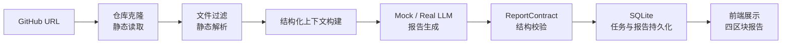

# CodePilot | AI 代码审查与仓库理解系统

English version: [README.en.md](README.en.md)

前置静态解析 + 结构化上下文 + 证据绑定，让大模型生成可复查的仓库审查报告。


## 📚 目录

- [项目背景](#-项目背景为什么做)
- [项目定位与核心能力](#-项目定位与核心能力)
- [架构与核心实现](#️-架构与核心实现)
- [技术栈](#️-技术栈)
- [量化效果](#-量化效果)
- [快速开始](#-快速开始)
- [目录结构](#-目录结构)
- [后续规划](#️-后续规划)
- [当前局限](#️-当前局限)
- [常见问题](#-常见问题)
- [贡献指南](#-贡献指南)
- [许可证](#-license)

## 🎯 项目背景：为什么做？

中小型 GitHub 仓库的理解和审查经常卡在三个现实问题上：

- 人工阅读仓库耗时长、依赖经验，输出质量容易随审查者状态波动。
- 通用大模型直接问答缺少完整仓库上下文，容易给出泛化建议，难以复查依据。
- 传统静态分析工具偏语法、规范和安全检查，通常不生成架构级理解报告。

CodePilot 面向中小型 Python 仓库，用"静态解析提取事实 + LLM 生成解释"的方式，把仓库文件、符号、依赖、规模指标先整理成结构化上下文，再生成带证据的代码理解与审查报告。

## ✨ 项目定位与核心能力

CodePilot 是一个面向中小型 GitHub 仓库的 AI 代码审查 MVP，当前优先支持 Python 仓库。输入公开仓库 URL 后，系统静态读取仓库并输出四区块报告：

- 架构概览
- 代码坏味道
- 可维护性分析
- 重构建议

### 核心能力

- **前置静态解析降噪**：过滤低价值文件，降低大模型输入规模。
- **结构化证据绑定（Evidence Binding）**：让 finding 绑定具体文件路径、函数、类、依赖和指标，方便复查。
- **ReportContract 报告契约**：统一报告结构，隔离 LLM 输出波动，确保四区块格式一致。
- **Mock / Real LLM 双模式**：开发、测试、CI 可稳定复现；真实模型可用于报告生成验证。
- **Provider 接口**：隔离 Mock LLM 与真实 LLM 的模型调用层，方便替换不同模型。
- **SQLite 持久化**：保存任务状态和历史报告，支持前端轮询展示。

### 非当前目标

- 不支持大型 monorepo。
- 不做所有语言全覆盖。
- 不执行用户仓库代码，只做静态分析。
- 不做自动修复。
- 不是成熟商业代码审查平台。

## 🏗️ 架构与核心实现

### 整体链路



> 文本链路：GitHub URL → 仓库克隆 → 文件过滤 / 静态解析 → 结构化上下文构建 → Mock / Real LLM 报告生成 → ReportContract 校验 → SQLite 持久化 → 前端展示

### 1. 前置工程降噪

**核心目标：** 让 LLM 输入从杂乱原始文件变成低噪声、结构化、可统计的仓库事实。

- 过滤 `.git`、`__pycache__`、`.venv`、`dist`、`build` 等低价值内容，减少无效上下文。
- 保留源码、配置文件和 README，保证模型仍能理解项目结构。
- 使用 Python AST，并保留 tree-sitter extension-ready 的解析路径，提取函数、类、导入依赖和文件规模。
- 用结构化上下文替代原始代码直喂，减少噪声并保留可定位的工程事实。

### 2. 报告质量控制

**核心目标：** 让报告格式一致、建议可复查，而不是自由生成主观评价。

- 固定四区块报告结构：架构概览、代码坏味道、可维护性分析、重构建议。
- `ReportContract`（报告结构契约）统一报告结构，约束 LLM 输出固定格式，隔离输出波动。
- Evidence Binding（证据绑定）让每个 finding 绑定文件路径、函数、类、依赖和指标，方便人工复查。
- 目标是让报告可追溯、可验证，而非依赖 LLM 自由发挥。

### 3. 工程稳定性保障

**核心目标：** 让开发、测试和真实 LLM 调用都能稳定复现和定位问题。

- **Mock / Real 双模式**：Mock LLM 用于开发、测试和 CI，输出稳定可复现；Real LLM 用于真实报告生成验证。
- **Provider 接口**：隔离 Mock LLM 与真实 LLM 的模型调用层，让模型层可插拔，方便替换不同模型。
- **任务分阶段记录**：失败后可以定位到克隆、解析、LLM 或报告合成阶段。
- **全链路质量校验**：`pytest`（测试）+ `ruff`（静态检查）+ `audit_harness`（全链路审计校验工具，验证仓库分析、报告生成、持久化和输出结构是否完整）覆盖测试、规范和工程一致性。

## 🛠️ 技术栈

| 层级 | 技术栈 | 选型原因 |
|---|---|---|
| Backend | FastAPI 0.115.6 + Pydantic 2.10.4 + Uvicorn 0.34.0 | 适合结构化 API，内置参数校验与模型约束，便于前后端联调 |
| Frontend | Next.js 15.5.19 + React 19.0.0 + TypeScript 5.7.2 + Tailwind CSS 3.4.17 | 适合多状态 UI 和报告区块化展示，TypeScript 降低接口字段不一致风险 |
| Persistence | SQLite（Python stdlib，WAL 模式） | 轻量、低部署成本，满足 MVP 阶段任务记录与历史报告回溯 |
| Parsing | Python AST + tree-sitter 0.24.0 / tree-sitter-language-pack 0.7.0 | Python AST 适合 MVP 快速验证，tree-sitter 便于后续多语言扩展 |
| Token Counting | tiktoken 0.13.0 | 统一 Token 估算方法，支撑量化指标计算 |
| LLM | Mock Provider + OpenAI-compatible Real LLM Provider（MiMo / Doubao / DeepSeek 配置） | Mock 保证测试稳定，Real LLM 用于真实报告生成，Provider 接口隔离模型差异 |
| Quality | pytest + ruff + audit_harness + GitHub Actions | 测试、静态检查、全链路审计和 CI 覆盖 |

## 📊 量化效果

### 指标总览

| 验证维度 | 结果 | 对比基准 / 样本范围 | 业务价值 |
|---|---:|---|---|
| 平均文件降噪率 | 49.1% | 3 个基准仓库，60-79 个 Python 源码文件，`git ls-files` 业务文件基线 | 减少低价值文件进入分析链路，让模型关注核心源码 |
| 结构化上下文 Token 压缩率 | 96.8% | 同范围有效源码原始 Token vs 结构化上下文 Token | 显著降低 LLM 输入规模 |
| httpx 真实 LLM 输入 Token 压缩率 | 88.7% | httpx 单仓真实调用，只统计输入 Token | 验证真实调用场景下仍能降低输入规模 |
| 输入规模降低 | 约 8.85 倍 | httpx：137417 vs 15212 input tokens | 相比原始代码直喂，输入更可控 |
| 证据绑定率 | 100% vs 0% | httpx 单仓，CodePilot vs 原始代码直喂 | 提升报告可复查性 |
| pytest | 1000 passed, 1 skipped | 测试工具原生输出 | 验证主链路稳定性 |
| ruff | 0 issues | 静态检查 | 保证基础代码规范 |
| audit_harness | passed | 全链路审计校验 | 验证端到端流程完整 |

### 口径说明

- **文件降噪率**：以 `git ls-files` 统计的 Git 跟踪原生业务文件为基线，排除 `.git`、依赖目录、虚拟环境等非业务内容。
- **Token 压缩率**：对比同范围有效源码的原始代码 Token 与结构化上下文 Token，统一使用 tiktoken 估算。
- **输入规模降低 8.85 倍**：137417 / 15212 ≈ 8.85，即 httpx 对照组输入 Token 除以 CodePilot 输入 Token。
- **只统计输入 Token**：不包含输出 Token，不能表述为总成本降低。
- **httpx 对照实验**：是单仓定性验证，不代表大规模统计结论。
- **证据绑定率**：v1.0 规则下统计，不等于报告绝对正确。

## 🚀 快速开始

### 环境要求

- Python 3.11+
- Node.js（版本以 `frontend/package.json` 为准）
- Conda 或 venv
- Git

> 当前 README 不提供 Docker 启动说明，Docker 环境将在后续版本补充。

### 环境检查

```bash
python --version
node --version
npm --version
git --version
```

### Windows PowerShell（推荐）

推荐使用仓库自带 PowerShell 脚本。该路径会创建 `codepilot` conda 环境、安装后端依赖、安装前端依赖，并启动后端与前端。

```powershell
git clone https://github.com/Strange-Men/CodePilot.git
cd CodePilot
Set-ExecutionPolicy -Scope Process Bypass
.\scripts\setup.ps1
.\scripts\start-demo.ps1
```

启动后访问：

- Frontend: [http://localhost:3000](http://localhost:3000)
- Backend: [http://localhost:8000](http://localhost:8000)
- Health Check: [http://localhost:8000/health](http://localhost:8000/health)

如果 `conda.exe` 不在 PATH 中：

```powershell
$env:CODEPILOT_CONDA = "path\to\your\conda.exe"
.\scripts\setup.ps1
```

### Linux / macOS（Manual Setup）

> 项目当前未提供 Linux / macOS 自动化脚本，以下为手动启动步骤。

```bash
# 克隆仓库
git clone https://github.com/Strange-Men/CodePilot.git
cd CodePilot

# 后端
python -m venv .venv
source .venv/bin/activate
pip install -r backend/requirements.txt
python -m uvicorn backend.main:app --reload --host 127.0.0.1 --port 8000

# 前端（新终端）
cd frontend
npm install
export NEXT_PUBLIC_API_BASE="http://localhost:8000"
npm run dev -- --port 3000
```

### 手动启动（Windows PowerShell）

```powershell
# 后端
python -m venv .venv
.\.venv\Scripts\Activate.ps1
pip install -r backend\requirements.txt
python -m uvicorn backend.main:app --reload --host 127.0.0.1 --port 8000

# 前端（新终端）
cd frontend
npm install
$env:NEXT_PUBLIC_API_BASE = "http://localhost:8000"
npm run dev -- --port 3000
```

### 测试与质量校验

```powershell
# 后端测试与检查
python -m pytest tests/ -q
ruff check .
python scripts/audit_harness.py

# 前端测试与构建
cd frontend
npm test
npm run build
```

### 启动排查

- **端口占用**：检查后端 8000 / 前端 3000 端口是否被占用，脚本会自动检测并提示。
- **Conda 环境异常**：确认当前 Python 版本为 3.11+，并确认依赖安装路径正确。
- **LLM 调用失败**：检查 `.env` 中的 API 配置；Mock 模式可用于无 API key 的本地验证。
- **前端无法访问后端**：确认 `NEXT_PUBLIC_API_BASE` 环境变量指向后端地址。

## 📁 目录结构

```text
CodePilot/
├── backend/          # FastAPI backend, parsers, LLM providers, review pipeline
├── frontend/         # Next.js/React/TypeScript frontend
├── contracts/        # Report section contract files
├── docs/             # Architecture, setup, evaluation and release docs
├── evaluation/       # Evaluation datasets, metrics and comparison scripts
├── reports/          # Generated metric and validation outputs
├── scripts/          # Setup, startup, audit and metric scripts
├── tests/            # Unit, integration, regression and metric tests
├── Dockerfile.backend
├── Dockerfile.frontend
├── docker-compose.yml
├── README.md
└── README.en.md
```

## 🛣️ 后续规划

### P0：可靠性与可信度

- 增强报告证据链：绑定代码片段、影响范围、重构优先级。
- 增强真实 LLM 稳定性：schema 校验、自动重试、fallback。
- 加固安全沙箱：目录隔离、文件数量 / 大小限制、超时控制。

### P1：能力扩展

- 扩展多语言支持：优先 JavaScript / TypeScript，基于 tree-sitter。
- 增加 evaluation dashboard，展示每次迭代的核心指标变化。

### P2：产品化能力

- 权限系统
- 任务队列
- 云端部署

## ⚠️ 当前局限

### 功能范围

- 当前优先支持 Python 仓库。
- 不支持大型 monorepo。
- 不做自动修复。

### 安全边界

- 不执行用户仓库代码，只做静态分析。
- 安全沙箱仍需继续加固。

### LLM 验证范围

- 真实 LLM 仅完成 httpx 单仓端到端验证。
- Baseline 对照是单仓定性验证，不代表大规模统计结论。

### 产品化程度

- 当前是 MVP，不是成熟商业代码审查平台。
- 暂无完整权限系统、任务队列和云端多用户部署。
- JavaScript / TypeScript 已有解析入口和测试覆盖，但当前分析深度弱于 Python。
- 本地和演示部署中的 SQLite 历史记录取决于实际存储配置；Render Free 等临时存储环境重启后可能丢失历史。

## ❓ 常见问题

### 1. 这是普通大模型套壳吗？

不是。CodePilot 的核心差异在于前置静态解析、结构化上下文构建、Evidence Binding（证据绑定）、ReportContract（报告结构契约）、SQLite 持久化和量化评估体系，而不是简单地把代码丢给大模型。

### 2. 没有真实 LLM API key 能运行吗？

可以。Mock 模式是默认模式，可完成本地功能验证和前端展示。真实报告生成需要在 `.env` 中配置真实 LLM 的 API key。

### 3. 为什么不执行用户仓库代码？

为了安全。CodePilot 只做静态分析（AST 解析、文件过滤、指标统计），避免执行外部仓库脚本带来的安全风险。

### 4. 为什么只优先支持 Python？

Python AST 解析器成熟且为标准库自带，适合 MVP 快速验证完整链路。后续通过 tree-sitter 扩展 JavaScript / TypeScript 等语言。

### 5. LLM 调用失败怎么办？

检查 `.env` 中的 API 配置、网络连接和模型返回格式。系统支持失败阶段记录，Mock 模式可用于无 API key 场景下的本地验证。

### 6. 数据安全吗？代码会被上传到外部服务吗？

仓库克隆到本地后进行静态分析。只有结构化上下文（非原始源码）会发送给 LLM。Mock 模式下不会有任何数据离开本地。

## 🤝 贡献指南

欢迎提交 Issue 或 PR，建议遵守以下原则：

- Issue 请说明复现步骤、运行环境、错误日志和期望行为。
- PR 请保持小步修改，优先一个 PR 解决一个问题。
- 新增功能请补充测试或说明验证方式。
- 不要提交 API key、`.env`、本地缓存、截图临时文件。
- 涉及 LLM 行为变化时，请说明对报告结构和量化指标的影响。

## 📄 License

MIT License
