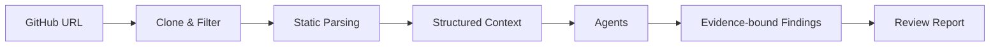

# CodePilot | AI 代码审查与仓库理解系统

English version: [README.en.md](README.en.md)

CodePilot 是一个面向 Python 仓库的 AI 代码审查与仓库理解系统。它先做工程降噪、结构化上下文构建和证据绑定，再让大模型生成可复查的代码审查报告——而不是把仓库直接丢给 LLM。


## 目录

- [为什么做](#为什么做)
- [做什么](#做什么)
- [怎么做](#怎么做)
- [效果](#效果)
- [验证案例](#验证案例)
- [快速开始](#快速开始)
- [Docker 本地运行](#docker-本地运行)
- [技术栈](#技术栈)
- [已知边界与规划](#已知边界与规划)
- [Contributing](#contributing)
- [License](#license)

## 为什么做

中小型 Python 仓库审查时，常见三个问题：

- 人工阅读仓库成本高，输出稳定性依赖审查者经验。
- 通用大模型直接问答缺少完整仓库上下文，容易给出泛化建议，难以复查依据。
- 传统静态分析工具偏语法和风格检查，难以生成面向架构与维护性的综合审查报告。

CodePilot 面向中小型 Python 仓库，用"静态解析提取事实 + LLM 生成解释"的方式，先把仓库文件、符号、依赖和规模指标整理成结构化上下文，再输出带证据的代码审查报告。

## 做什么

CodePilot 输入公开仓库 URL 后，输出四区块审查报告：

- **架构概览** — 仓库结构与模块关系
- **代码坏味道** — 可定位的具体问题
- **可维护性分析** — 基于结构化指标的评估
- **重构建议** — 带证据引用的改进建议

### 目标

- 为中小型 Python 仓库生成结构化、可复查、带证据引用的 AI 代码审查报告。
- 前置静态解析降噪，降低大模型输入规模。
- 结构化证据绑定，让建议可追溯到文件、函数、类、依赖和指标。
- Mock / Real LLM 双模式解耦，开发、测试和 CI 稳定可复现。

### 边界

- 不是替代安全审计，不承诺自动修复。
- 不承诺覆盖所有语言，当前优先 Python。
- 不执行用户仓库代码，只做静态分析。
- 不包装成完整商业化代码审查平台。

## 怎么做



### 前置工程降噪

CodePilot 不把仓库原始代码直接全部喂给模型，而是在 LLM 之前先做工程降噪：

- 过滤 `.git`、`__pycache__`、`.venv`、`dist`、`build` 等低价值内容。
- 保留源码、配置文件和 README，保证模型仍能理解仓库结构。
- 使用 Python AST 提取函数、类、导入依赖和文件规模，保留 tree-sitter 扩展路径。
- 用结构化上下文替代原始代码直喂，减少噪声并保留可定位的工程事实。

### 报告质量控制

报告生成受结构契约约束，不是自由散文：

- 固定四区块报告结构：架构概览、代码坏味道、可维护性分析、重构建议。
- `ReportContract` 统一报告结构，约束 LLM 输出格式，降低模型输出波动对前端和历史记录的影响。
- 证据字段让 finding 绑定文件路径、函数、类、依赖和指标。
- 目标是让报告可复查，而不是生成难以追踪依据的主观评价。

### 工程稳定性保障

系统把真实模型调用和本地工程验证解耦：

- Mock LLM 用于开发、测试和 CI，输出稳定可复现。
- Real LLM 用于真实报告生成验证。
- Provider 接口隔离模型调用层，便于替换不同 OpenAI-compatible Provider。
- 任务分阶段记录，失败后可定位到克隆、解析、LLM 或报告合成阶段。
- `pytest` / `ruff` / `audit_harness` 覆盖测试、静态检查和全链路校验。

## 效果

### 工程降噪

| 指标 | 结果 | 口径 |
|---|---:|---|
| 平均文件降噪率 | 49.1% | 3 个基准仓库，`git ls-files` 业务文件基线 |
| 结构化上下文 Token 压缩率 | 96.8% | 同范围有效源码 vs 结构化上下文，tiktoken 估算 |

### 真实 LLM 单仓验证

- 验证仓库：httpx。
- 对照组输入 Token：137417。
- CodePilot 输入 Token：15212。
- 输入规模降低：约 8.85 倍。
- 真实 LLM 调用输入 Token 压缩率：88.7%。

说明：这是 httpx 单仓定性验证，不代表大规模统计结论。只统计输入 Token，不包含输出 Token，不能表述为总成本降低。

### 工程质量

| 验证维度 | 结果 | 口径 |
|---|---|---|
| pytest | 1034 passed, 1 skipped | 测试工具原生输出 |
| ruff | 0 issues | 静态检查 |
| audit_harness | passed | 全链路审计校验 |
| Mock 模式审查成功率 | 100% | Mock 契约与证据字段完整性 |
| Docker 本地运行 | verified | config / build / up 通过 |

## 验证案例

在以下 Python 开源仓库上完成 benchmark 验证：

- [httpx](https://github.com/encode/httpx)
- [click](https://github.com/pallets/click)
- [uvicorn](https://github.com/encode/uvicorn)

## 快速开始

### Windows PowerShell 脚本启动

仓库提供了 Windows PowerShell 脚本，会创建 `codepilot` conda 环境、安装依赖并启动前后端：

```powershell
git clone https://github.com/Strange-Men/CodePilot.git
cd CodePilot
Set-ExecutionPolicy -Scope Process Bypass
.\scripts\setup.ps1
.\scripts\start-demo.ps1
```

启动后访问：

- Frontend: [http://localhost:3000](http://localhost:3000)
- Backend: [http://localhost:8000](http://localhost:8000)
- Health Check: [http://localhost:8000/health](http://localhost:8000/health)

如果 `conda.exe` 不在 PATH 中：

```powershell
$env:CODEPILOT_CONDA = "path\to\your\conda.exe"
.\scripts\setup.ps1
```

### 手动启动

```powershell
# 后端
python -m venv .venv
.venv\Scripts\Activate.ps1
pip install -r backend/requirements.txt
python -m uvicorn backend.main:app --reload --host 127.0.0.1 --port 8000

# 前端（新终端）
cd frontend
npm install
npm run dev -- --port 3000
```

前端启动时可显式设置后端地址：

```powershell
$env:NEXT_PUBLIC_API_BASE = "http://localhost:8000"
npm run dev -- --port 3000
```

## Docker 本地运行

```powershell
# Windows
Copy-Item .env.example .env
docker compose up --build

# macOS / Linux
cp .env.example .env
docker compose up --build
```

启动后访问：

- Frontend: http://localhost:3000
- Backend: http://localhost:8000
- Health: http://localhost:8000/health

默认使用 Mock LLM 模式，不需要真实 API Key。使用真实模型需在 `.env` 中配置对应 provider 的 API Key，详见 [Docker 本地运行文档](docs/DOCKER.md)。

停止与清理：

```powershell
docker compose down        # 停止容器
docker compose down -v     # 停止并删除 SQLite/workspace/reports volume
```

## 技术栈

| 层级 | 技术栈 | 说明 |
|---|---|---|
| Backend | FastAPI + Pydantic + Uvicorn | 结构化 API、参数校验、异步服务 |
| Frontend | Next.js + React + TypeScript + Tailwind CSS | 报告工作台、任务状态、证据展示 |
| Persistence | SQLite（WAL 模式） | 任务状态和历史报告持久化 |
| Parsing | Python AST + tree-sitter | Python 优先，保留多语言扩展路径 |
| LLM | Mock Provider + OpenAI-compatible Real LLM Provider | Mock 默认；Real LLM 可配置 |
| Deployment | Docker Compose | 本地开发与 demo 环境 |
| Quality | pytest + ruff + audit_harness + GitHub Actions | 测试、静态检查、全链路审计和 CI |

## 已知边界与规划

### 当前局限

- 当前主要面向 Python 仓库。
- Real LLM 成本与可用性依赖 provider 配置。
- 中文报告已经做了质量闸门，但极端模型输出仍需要继续回归测试。
- Docker 当前定位是本地 demo / 开发环境，不是生产级部署。
- JavaScript / TypeScript 已有解析入口和测试覆盖，但当前分析深度弱于 Python。

### 规划

- **短期**：继续增强中文/英文报告质量闸门；补充更多真实仓库 benchmark。
- **中期**：扩展 JavaScript/TypeScript 仓库理解；增强证据链可视化。
- **长期**：支持更完整的仓库级 Agent 工作流。

## Contributing

欢迎提交 issue / PR。请附上复现步骤、测试命令和变更说明。

## License

MIT License
