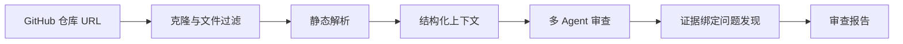

# CodePilot | AI 代码审查与仓库理解系统

English version: [README.en.md](README.en.md)

CodePilot 是一个面向 Python 仓库的 AI 代码审查与仓库理解系统。它先做工程降噪、结构化上下文构建和证据绑定，再让大模型生成可复查的代码审查报告——而不是把仓库直接丢给 LLM。


## 目录

- [为什么做](#为什么做)
- [做什么](#做什么)
- [怎么做](#怎么做)
  - [前置工程降噪](#前置工程降噪)
  - [报告质量控制](#报告质量控制)
  - [工程稳定性保障](#工程稳定性保障)
- [架构流程](#架构流程)
- [量化结果](#量化结果)
- [验证案例](#验证案例)
- [快速开始](#快速开始)
  - [PowerShell 脚本启动](#powershell-脚本启动)
  - [手动启动](#手动启动)
  - [Docker 本地运行](#docker-本地运行)
- [技术栈](#技术栈)
- [系统依赖](#系统依赖)
- [常见问题](#常见问题)
- [已知边界与规划](#已知边界与规划)
- [术语对照](#术语对照)
- [Contributing](#contributing)
- [License](#license)

## 为什么做

中小型 Python 仓库审查时，常见三个问题：

- 人工阅读仓库成本高，输出稳定性依赖审查者经验。
- 通用大模型直接问答缺少完整仓库上下文，容易给出泛化建议，难以复查依据。
- 传统静态分析工具偏语法和风格检查，难以生成面向架构与维护性的综合审查报告。

CodePilot 面向中小型 Python 仓库，用"静态解析提取事实 + LLM 生成解释"的方式，先把仓库文件、符号、依赖和规模指标整理成结构化上下文，再输出带证据的代码审查报告。

## 做什么

CodePilot 输入公开仓库 URL 后，输出四区块审查报告：

- **架构概览** — 仓库结构与模块关系
- **代码质量问题** — 可定位的具体问题
- **可维护性分析** — 基于结构化指标的评估
- **重构建议** — 带证据引用的改进建议

### 目标

- 为中小型 Python 仓库生成结构化、可复查、带证据引用的 AI 代码审查报告。
- 前置静态解析降噪，降低大模型输入规模。
- 结构化证据绑定，让建议可追溯到文件、函数、类、依赖和指标。
- Mock / Real LLM 双模式解耦，开发、测试和 CI 稳定可复现。

### 边界

当前项目聚焦代码审查与仓库理解，不包含安全审计、自动代码修复、生产级代码合并或多语言全覆盖能力。

- 不替代安全审计，不承诺自动修复代码。
- 不承诺覆盖所有语言，当前优先 Python。
- 不执行用户仓库代码，只做静态分析。
- 不包装成完整商业化代码审查平台。

## 怎么做

### 前置工程降噪

通过 git-tracked 文件基线、文件过滤、静态解析和结构化上下文，避免把整个仓库粗暴丢给 LLM：

- 过滤 `.git`、`__pycache__`、`.venv`、`dist`、`build` 等低价值内容。
- 保留源码、配置文件和 README，保证模型仍能理解仓库结构。
- 使用 Python AST 提取函数、类、导入依赖和文件规模，保留 tree-sitter 扩展路径。
- 用结构化上下文替代原始代码直喂，减少噪声并保留可定位的工程事实。

### 报告质量控制

通过结构化 finding、证据引用、中英文报告质量闸门、Mock/Real LLM 双模式，保证报告可复查：

- 固定四区块报告结构：架构概览、代码质量问题、可维护性分析、重构建议。
- `ReportContract` 统一报告结构，约束 LLM 输出格式，降低模型输出波动对前端和历史记录的影响。
- 证据字段让 finding 绑定文件路径、函数、类、依赖和指标。
- 中文报告经过本地化质量闸门，避免英文自然语言泄漏。

### 工程稳定性保障

通过 pytest、ruff、frontend test/build、audit_harness、Docker compose 验证，保证功能变更可回归：

- Mock LLM 用于开发、测试和 CI，输出稳定可复现。
- Real LLM 用于真实报告生成验证。
- Provider 接口隔离模型调用层，便于替换不同 OpenAI-compatible Provider。
- 任务分阶段记录，失败后可定位到克隆、解析、LLM 或报告合成阶段。

## 架构流程



## 量化结果

### 工程降噪

| 指标 | 结果 | 口径 |
|---|---:|---|
| 平均文件降噪率 | **49.1%** | 3 个基准仓库（httpx / click / uvicorn），以 `git ls-files` 统计仓库中被版本控制追踪的文件为基线，避免把 `.git`、`node_modules`、缓存目录等噪声算入 |
| 结构化上下文 Token 压缩率 | **96.8%** | 同范围有效源码 Token 数 vs 结构化上下文 Token 数，tiktoken 估算 |

### 真实 LLM 单仓验证

以 httpx 单仓真实调用记录为准，输入 Token 相比原始源码基线显著降低：

- 验证仓库：httpx
- 对照组输入 Token：137,417（原始源码直喂 LLM）
- CodePilot 输入 Token：15,212（结构化上下文）
- 输入规模降低：约 **8.85 倍**
- 真实 LLM 调用输入 Token 压缩率：**88.7%** ≈ 1 − 15,212 / 137,417

> 说明：该 Token 压缩率仅用于衡量有效源码输入从原始源码基线到结构化上下文的缩减，不代表端到端总成本下降，也不包含配置/文档等非核心输入。这是 httpx 单仓定性验证，不代表大规模统计结论。只统计输入 Token，不包含输出 Token，不能表述为总成本降低。

### 工程质量

| 验证维度 | 结果 | 口径 |
|---|---|---|
| pytest | **1034 passed, 1 skipped** | 测试工具原生输出 |
| ruff | 0 issues | 静态检查 |
| audit_harness | passed | 全链路审计校验 |
| Mock 模式审查成功率 | 100% | Mock 契约与证据字段完整性 |
| Docker 本地运行 | verified | config / build / up 通过 |

## 验证案例

在以下 Python 开源仓库上完成 benchmark 验证：

- [httpx](https://github.com/encode/httpx)
- [click](https://github.com/pallets/click)
- [uvicorn](https://github.com/encode/uvicorn)

这些仓库用于验证文件过滤、结构化上下文压缩、Mock 审查链路和报告契约稳定性。降噪率范围为 37.3%–58.0%，Token 压缩率范围为 95.7%–97.8%。

## 快速开始

### PowerShell 脚本启动

仓库提供了 Windows PowerShell 脚本，会创建 `codepilot` conda 环境、安装依赖并启动前后端：

```powershell
git clone https://github.com/Strange-Men/CodePilot.git
cd CodePilot
Set-ExecutionPolicy -Scope Process Bypass
.\scripts\setup.ps1
.\scripts\start-demo.ps1
```

启动后访问：

- Frontend: [http://localhost:3000](http://localhost:3000)
- Backend: [http://localhost:8000](http://localhost:8000)
- Health Check: [http://localhost:8000/health](http://localhost:8000/health)

如果 `conda.exe` 不在 PATH 中：

```powershell
$env:CODEPILOT_CONDA = "path\to\your\conda.exe"
.\scripts\setup.ps1
```

> 如果 `Set-ExecutionPolicy` 失败，请以管理员身份打开 PowerShell，或改用手动启动方式。
> 如果 conda 环境创建失败，请先确认 Conda 已加入 PATH，或直接使用 Python 3.11+ 虚拟环境。

### 手动启动

```powershell
# 后端
python -m venv .venv
.venv\Scripts\Activate.ps1
pip install -r backend/requirements.txt
python -m uvicorn backend.main:app --reload --host 127.0.0.1 --port 8000
```

```powershell
# 前端（新终端）
cd frontend
npm install
npm run dev -- --port 3000
```

macOS / Linux 用户可使用以下命令：

```bash
# 后端（macOS / Linux）
python -m venv .venv
source .venv/bin/activate
pip install -r backend/requirements.txt
python -m uvicorn backend.main:app --reload --host 127.0.0.1 --port 8000
```

```bash
# 前端（macOS / Linux，新终端）
cd frontend
npm install
npm run dev -- --port 3000
```

前端启动时可显式设置后端地址：

```powershell
$env:NEXT_PUBLIC_API_BASE = "http://localhost:8000"
npm run dev -- --port 3000
```

### Docker 本地运行

```powershell
# Windows PowerShell
Copy-Item .env.example .env
docker compose up --build
```

```bash
# macOS / Linux
cp .env.example .env
docker compose up --build
```

启动后访问：

- Frontend: http://localhost:3000
- Backend: http://localhost:8000
- Health: http://localhost:8000/health

核心配置项：

| 配置项 | 说明 |
|---|---|
| `USE_MOCK_LLM=true` | 默认 Mock 模式，不需要 API Key |
| `REAL_LLM_PROVIDER=mimo\|doubao\|deepseek` | 真实模型服务商 |
| `MIMO_API_KEY` / `DOUBAO_API_KEY` / `DEEPSEEK_API_KEY` | 只填写在后端 `.env`，不放前端 |

停止与清理：

```powershell
docker compose down        # 停止容器
docker compose down -v     # 停止并删除 SQLite/workspace/reports volume
```

详细配置和故障排查见 [Docker 本地运行文档](docs/DOCKER.md)。

## 技术栈

| 层级 | 技术栈 | 说明 |
|---|---|---|
| Backend | FastAPI + Pydantic + Uvicorn | FastAPI 搭建结构化 API，Pydantic 做请求/响应校验，Uvicorn 作为 ASGI 运行服务 |
| Frontend | Next.js + React + TypeScript + Tailwind CSS | 构建报告工作台、审查状态、Agent 卡片、问题发现和报告展示页面 |
| Persistence | SQLite（WAL 模式） | 本地轻量化历史记录和报告元数据存储，适合 MVP 与 demo 场景，无需额外数据库服务 |
| Parsing | Python AST + tree-sitter | Python 优先，保留多语言扩展路径 |
| LLM | Mock Provider + OpenAI-compatible Real LLM Provider | Mock 默认；Real LLM 可配置 mimo / doubao / deepseek |
| Deployment | Docker Compose | 提供本地一键启动前后端的 demo / 开发环境 |
| Quality | pytest + ruff + audit_harness + GitHub Actions | 测试、静态检查、全链路审计和 CI |

## 系统依赖

| 依赖 | 说明 |
|---|---|
| Python 3.11+ | 后端运行环境（已验证版本：3.11.11） |
| Node.js 20+ | 前端构建环境（Dockerfile.frontend 使用 `node:20-alpine`） |
| Docker Desktop + Docker Compose | 用于 Docker 本地运行 |
| Git | 用于克隆和分析目标仓库 |
| Conda（可选） | PowerShell 脚本启动方式使用；也可用 Python venv 替代 |

## 常见问题

**启动失败怎么办？**

先确认 Python 3.11+ 和 Node.js 已安装，`pip install` 和 `npm install` 无报错。如果使用 PowerShell 脚本，请确认 Conda 已加入 PATH 或使用手动启动方式。

**LLM 调用报错怎么办？**

Mock 模式不需要 API Key。Real LLM 需要在后端 `.env` 中配置对应 provider 的 Key、Base URL 和模型名称，然后重启后端服务。

**仓库克隆失败怎么办？**

先确认 GitHub URL 可访问、网络代理正常、仓库不是私有仓库，或改用公开仓库测试。

**Docker 前端连不上后端怎么办？**

确认后端容器运行中（`docker compose ps`），检查 `http://localhost:8000/health` 是否可达。前端通过 `NEXT_PUBLIC_API_BASE` 连接后端，默认 `http://localhost:8000`。详见 [docs/DOCKER.md](docs/DOCKER.md) 故障排查章节。

**中文报告为什么仍建议做回归测试？**

中文报告已通过本地化质量闸门过滤英文泄漏，但极端模型输出仍可能触发边界情况，建议版本更新后跑一次回归测试确认。

## 已知边界与规划

### 当前局限

- 当前主要面向 Python 仓库。
- Real LLM 成本与可用性依赖 provider 配置。
- 中文报告已经做了质量闸门，但极端模型输出仍需要继续回归测试。
- Docker 当前定位是本地 demo / 开发环境，不是生产级部署。
- JavaScript / TypeScript 已有解析入口和测试覆盖，但当前分析深度弱于 Python。

### 规划

- **短期（1-2 个月）**：继续增强中文/英文报告质量闸门；补充更多真实仓库 benchmark。
- **中期（3-6 个月）**：扩展 JavaScript/TypeScript 仓库理解；增强证据链可视化。
- **长期（6 个月+）**：探索更完整的仓库级 Agent 工作流和团队协作审查流程。

## 术语对照

| 中文 | English |
|---|---|
| 工程降噪 | Engineering Noise Reduction |
| 结构化上下文 | Structured Context |
| 证据绑定 | Evidence Binding |
| 质量闸门 | Quality Gate |
| 仓库理解 | Repository Understanding |
| 问题发现 | Findings |

支持中文 / 英文报告展示；中文模式会经过中文质量闸门，避免英文自然语言泄漏。

## Contributing

欢迎提交 issue / PR。请附上复现步骤、测试命令和变更说明。

## License

MIT License
